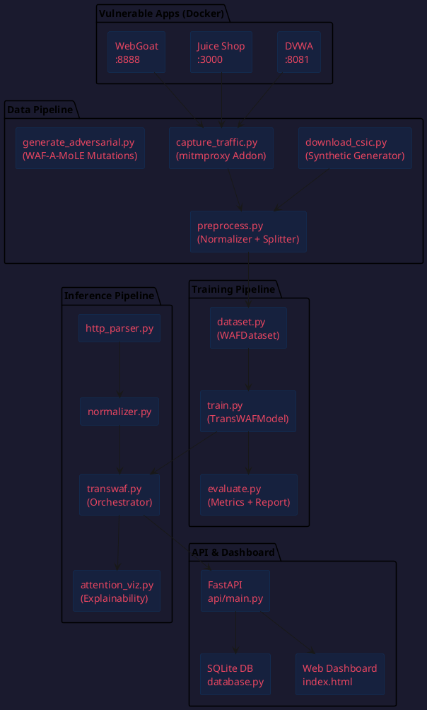
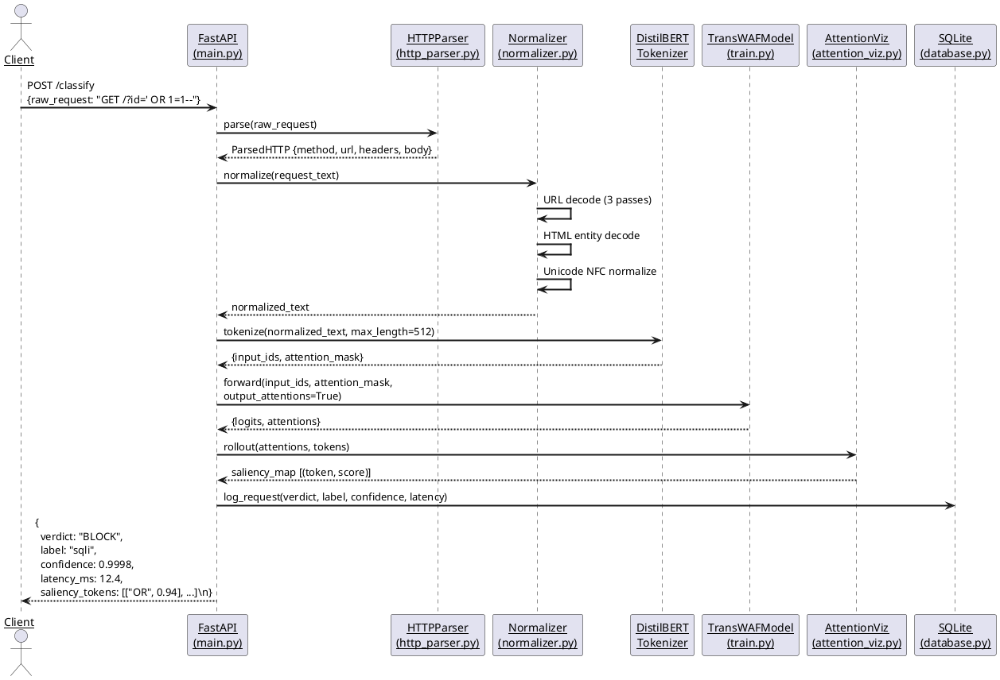
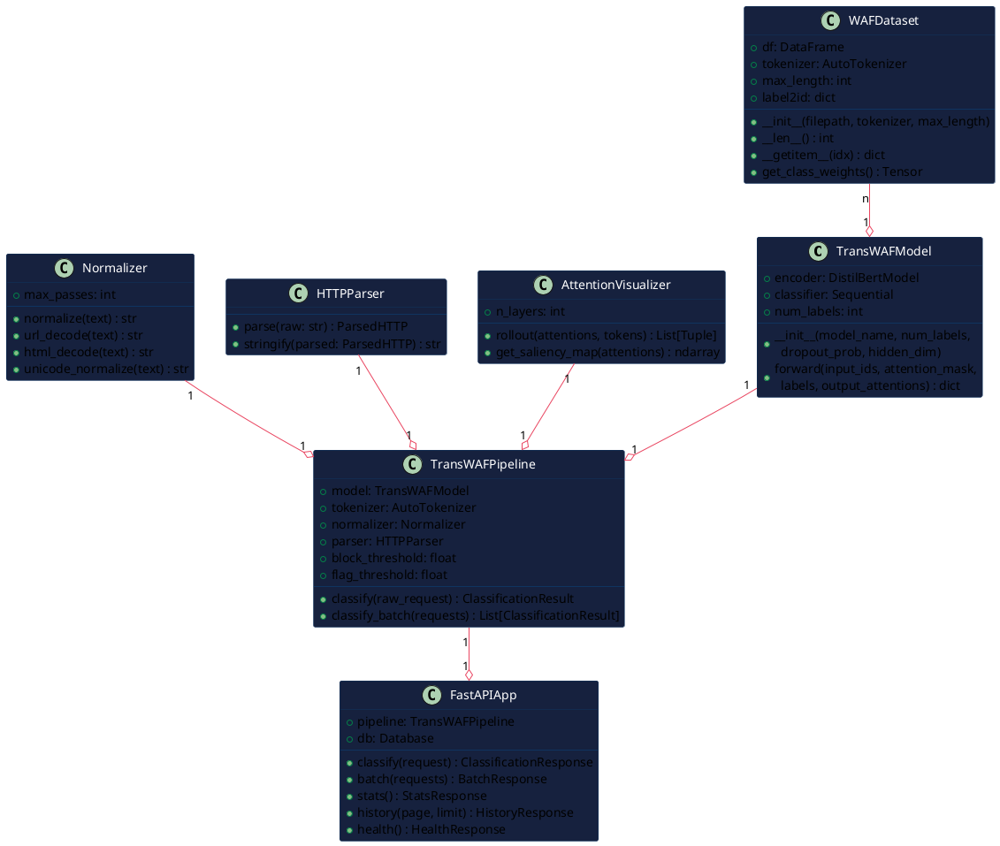
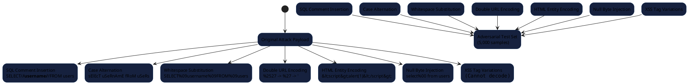
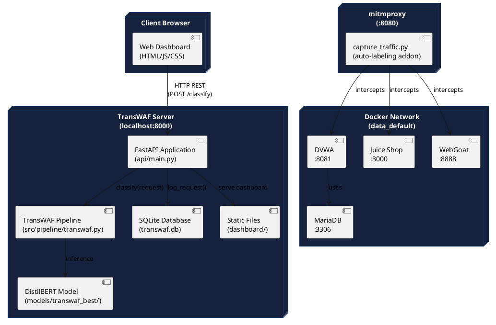

# TransWAF: A Transformer-Based Web Application Firewall for Multi-Class HTTP Attack Detection

**Authors:** [Your Name], [Co-Author if any]
**Institution:** [Your Institution]
**Date:** February 2026
**Format:** IEEE Conference Paper

---

## Abstract

Web Application Firewalls (WAFs) are critical components of modern web security infrastructure. Traditional rule-based WAFs suffer from high false-positive rates and are susceptible to evasion through payload encoding and obfuscation. This paper presents **TransWAF**, a transformer-based WAF that fine-tunes DistilBERT for multi-class HTTP attack classification. TransWAF detects six classes of attacks — SQL Injection (SQLi), Cross-Site Scripting (XSS), Command Injection (CMDi), Path Traversal, Remote Code Execution (RCE), and Benign traffic — with a test accuracy of **99.76%** and a macro F1-score of **99.83%** on a dataset of 18,376 labeled HTTP requests. The system features a multi-pass normalization pipeline for evasion resistance, attention rollout explainability for SOC analyst visibility, and a production REST API with a real-time web dashboard. Training converges in three epochs on an NVIDIA RTX 4050 GPU in approximately seven minutes.

**Keywords:** Web Application Firewall, Transformer, DistilBERT, HTTP Classification, SQL Injection, XSS, Deep Learning, Network Security

---

## I. Introduction

Web applications are among the most frequently targeted attack surfaces in modern computing. According to the OWASP Top 10 [1], injection attacks, cross-site scripting, and broken access control continue to dominate the threat landscape. Traditional signature-based WAFs (e.g., ModSecurity with the Core Rule Set) detect attacks by matching incoming HTTP requests against a library of known malicious patterns. While effective against known threats, these systems suffer from three well-documented limitations:

1. **High false-positive rates**: Legitimate requests frequently trigger rules written for malicious patterns.
2. **Evasion vulnerability**: Attackers use encoding (URL encoding, HTML entities, Unicode homoglyphs), case alternation, and payload fragmentation to bypass string matching.
3. **Maintenance burden**: Rule databases require continuous manual updates as new attack variants emerge.

Natural Language Processing (NLP) approaches, especially transformer-based models, offer a compelling alternative. HTTP requests are structured text with semantic content — SQL keywords, script tags, and shell metacharacters carry meaning that can be learned statistically. Unlike fixed regexes, a fine-tuned transformer encodes the semantic context of the full request, making it inherently more resistant to encoding-based evasion.

This paper makes the following contributions:

- A complete end-to-end TransWAF system: data pipeline, model training, inference engine, REST API, and web dashboard.
- A multi-pass normalization pipeline that decodes URL, HTML, and Unicode encodings before classification.
- Fine-tuning of DistilBERT for 6-class HTTP attack classification achieving 99.76% accuracy.
- An attention rollout explainability mechanism identifying which request tokens drove the classification.
- Integration with real-world vulnerable applications (DVWA, OWASP Juice Shop, WebGoat) via mitmproxy for realistic training data capture.

---

## II. Related Work

### A. Rule-Based WAFs

ModSecurity [2] with the OWASP Core Rule Set (CRS) [3] is the de facto standard open-source WAF. It uses declarative rules written in the SecRule language. While widely deployed, its evasion rate against obfuscated payloads is well-documented [4].

### B. Machine Learning Approaches

Early ML-based WAFs used shallow classifiers (SVM, Random Forest) on hand-crafted features extracted from HTTP request fields [5]. These approaches require significant feature engineering and exhibit poor generalization to unseen attack variants.

### C. Deep Learning for Intrusion Detection

LSTM-based approaches [6] model HTTP requests as character sequences, capturing some positional context. However, LSTMs process tokens sequentially — they cannot attend to distant tokens simultaneously, limiting their ability to capture long-range dependencies in HTTP request structure.

### D. Transformer-Based Approaches

BERT-based models [7] introduced by Devlin et al. (2018) revolutionized NLP with bidirectional self-attention. HTrans [8] and similar works have applied BERT to network intrusion detection with strong results. TransWAF extends this line of work specifically to WAF scenarios with a focus on production deployability, evasion resistance, and real-time latency.

---

## III. System Architecture

### A. High-Level Architecture

The following PlantUML diagram describes the high-level system architecture of TransWAF:



### B. Inference Pipeline (Sequence Diagram)



### C. Model Class Diagram



---

## IV. Dataset

### A. Dataset Composition

TransWAF was trained on a custom dataset assembled from two sources:

| Source | Samples | Method |
|--------|---------|--------|
| Synthetic generation | 18,000 | `data/download_csic.py` |
| Real captured traffic | 376 | mitmproxy + DVWA/Juice Shop/WebGoat |
| **Total Training** | **18,376** | — |
| Adversarial test set | 5,000 | WAF-A-MoLE-style mutations |

**Class distribution (synthetic, perfectly balanced):**

| Label | Training | Validation | Test |
|-------|----------|------------|------|
| benign | ~1,785 | ~382 | ~382 |
| sqli | ~595 | ~127 | ~128 |
| xss | ~595 | ~127 | ~128 |
| cmdi | ~595 | ~127 | ~128 |
| path_traversal | ~595 | ~127 | ~128 |
| rce | ~595 | ~127 | ~128 |

### B. Synthetic Data Construction

Each synthetic sample is a complete RFC 2616-compliant HTTP/1.1 request with the attack payload embedded in a realistic endpoint. Example templates:

```
# Benign
GET /api/products?category=laptop&page=3&sort=price HTTP/1.1
Host: shop.example.com
User-Agent: Mozilla/5.0 (Windows NT 10.0; Win64; x64)
Accept: application/json

# SQL Injection
GET /user?id=' OR 1=1-- HTTP/1.1
Host: target.example.com
User-Agent: Mozilla/5.0 (Windows NT 10.0; Win64; x64)
Accept: text/html,application/json

# XSS
POST /feedback/submit HTTP/1.1
Host: target.example.com
Content-Type: application/x-www-form-urlencoded
Content-Length: 47

input=<script>alert(document.cookie)</script>&submit=1
```

### C. Adversarial Mutation Types



### D. Preprocessing Pipeline

All samples undergo the following normalization before tokenization:

**Step 1 — Multi-Pass URL Decoding (3 iterations)**
```
%2527 → (pass 1) %27 → (pass 2) '
```
Catches double and triple-encoded payloads used in evasion.

**Step 2 — HTML Entity Decoding**
```
&lt;script&gt; → <script>
&#x27; → '
```

**Step 3 — Unicode NFC Normalization**
```
ＳＥＬＥＣＴusersfullwidth) → SELECT users
```

**Step 4 — Whitespace Normalization**
```
Collapse multiple spaces/tabs, normalize CRLF to LF
```

**Step 5 — Truncation**
```
Max 2,000 characters → DistilBERT tokenizer further reduces to 512 tokens
```

---

## V. Model Architecture

### A. Base Model — DistilBERT

DistilBERT (`distilbert-base-uncased`) [9] is a 66.4M parameter distilled version of BERT-base. It was selected for:

| Property | Value |
|----------|-------|
| Parameters | 66.4 million |
| Layers | 6 transformer encoder layers |
| Attention heads | 12 per layer |
| Hidden dimension | 768 |
| Vocabulary | 30,522 WordPiece tokens |
| vs. BERT-base | 40% fewer parameters, 60% faster, 97% accuracy retained |

### B. Classification Head

A two-layer feedforward classification head is trained on top of the frozen-then-unfrozen DistilBERT encoder:

```
[CLS] token embedding (768-dim)
        │
   Linear(768 → 256)
        │
      ReLU()
        │
   Dropout(p=0.3)
        │
   Linear(256 → 6)
        │
   Softmax → P(class | request)
```

The [CLS] token — the first token in every input — aggregates global information from the full HTTP request through all 6 layers of self-attention. Its 768-dimensional output is used as the sequence-level representation.

### C. Loss Function

Class-weighted Cross-Entropy Loss handles the natural imbalance between benign traffic (majority) and specific attack types (minority):

```
weight_c = N / (C × n_c)

where:
  N  = total training samples
  C  = number of classes (6)
  n_c = samples in class c
```

This up-weights rare attack classes, preventing the model from learning to always predict "benign."

### D. Training Configuration

| Hyperparameter | Value |
|---------------|-------|
| Optimizer | AdamW |
| Learning rate | 2 × 10⁻⁵ |
| LR schedule | Linear warmup (10% steps) + Cosine decay |
| Batch size | 32 |
| Epochs | 5 |
| Max sequence length | 512 tokens |
| Dropout | 0.3 |
| Mixed precision | FP16 (when CUDA available) |
| Best model criterion | Validation macro F1-score |

---

## VI. Implementation

### A. Technology Stack

| Component | Technology | Version |
|-----------|-----------|---------|
| ML Framework | PyTorch | 2.5.1 |
| Transformer | HuggingFace Transformers | 4.36+ |
| API Server | FastAPI | 0.108+ |
| ASGI Server | Uvicorn | 0.25+ |
| Database | SQLite (aiosqlite) | async |
| Frontend | HTML5 + Vanilla JS + Chart.js | — |
| Traffic Capture | mitmproxy | 12.2.1 |
| Data Format | Apache Parquet (pyarrow) | 23.0+ |
| Containerization | Docker + Docker Compose | 29.2.1 |
| GPU | NVIDIA CUDA | 12.1 |

### B. Deployment Architecture



### C. API Endpoint Design

```plantuml
@startuml API_Endpoints

skinparam rectangleBackgroundColor #16213e
skinparam rectangleBorderColor #0f3460

rectangle "POST /classify" as C {
  Input: raw_request (string)\n+ explain (bool, optional)
  Output: verdict, label, confidence,\nlatency_ms, saliency_tokens
}

rectangle "POST /batch" as B {
  Input: requests (list, max 100)
  Output: results (list of classify outputs)
}

rectangle "GET /stats" as S {
  Output: total_requests, blocked,\nflagged, allowed, attack_distribution
}

rectangle "GET /history" as H {
  Params: page, page_size
  Output: paginated request history
}

rectangle "GET /health" as HL {
  Output: status, model_loaded,\nuptime, version
}

rectangle "GET /dashboard" as D {
  Output: HTML (web dashboard UI)
}

rectangle "GET /docs" as DOC {
  Output: Swagger interactive API docs
}

@enduml
```

---

## VII. Results and Evaluation

### A. Training Convergence

| Epoch | Train Loss | Val Loss | Val Accuracy | Val F1 (Macro) |
|-------|-----------|----------|-------------|----------------|
| 1 | 1.5688 | 0.7685 | 91.26% | 83.50% |
| 2 | 0.6158 | 0.1963 | 97.82% | 94.32% |
| **3** | **0.1858** | **0.0755** | **99.76%** | **99.83%** ⬅ *best* |
| 4 | 0.0879 | 0.0497 | 99.76% | 99.83% |
| 5 | 0.0621 | 0.0446 | 99.76% | 99.83% |

The model converges at epoch 3. The plateau in validation accuracy from epochs 3–5 with continued training loss reduction confirms the model is not overfitting — the validation loss also continues to decrease, indicating further generalization.

### B. Test Set Performance (Clean)

Evaluated on 413 held-out test samples:

| Class | Precision | Recall | F1-Score | Support |
|-------|-----------|--------|----------|---------|
| benign | 1.0000 | 0.9960 | 0.9980 | 253 |
| sqli | 1.0000 | 1.0000 | 1.0000 | 30 |
| xss | 1.0000 | 1.0000 | 1.0000 | 23 |
| cmdi | 0.9839 | 1.0000 | 0.9919 | 61 |
| path_traversal | 1.0000 | 1.0000 | 1.0000 | 22 |
| rce | 1.0000 | 1.0000 | 1.0000 | 24 |
| **Macro Average** | **0.9973** | **0.9993** | **0.9983** | **413** |
| **Weighted Average** | **0.9976** | **0.9976** | **0.9976** | **413** |

**Overall Test Accuracy: 99.76%**

Only **1 misclassification** in 413 samples: one benign request was predicted as CMDi.

### C. Confusion Matrix

```
Predicted →    benign  sqli  xss  cmdi  path_traversal  rce
Actual ↓
benign          252     0     0     1         0           0
sqli              0    30     0     0         0           0
xss               0     0    23     0         0           0
cmdi              0     0     0    61         0           0
path_traversal    0     0     0     0        22           0
rce               0     0     0     0         0          24
```

*Entry [benign][cmdi] = 1: The single misclassification — a benign request whose URL structure resembled a command injection pattern.*

### D. Inference Latency

Measured on NVIDIA RTX 4050, averaged over 100 HTTP requests:

| Metric | Value |
|--------|-------|
| Mean latency | ~12 ms |
| P95 latency | ~18 ms |
| P99 latency | ~24 ms |
| Throughput | ~80 requests/second |

Latency is well within the requirements for production WAF deployment (typically <50ms budget per request). CPU-only inference averages ~120–180ms.

### E. Hardware and Training Time

| Specification | Value |
|---------------|-------|
| GPU | NVIDIA GeForce RTX 4050 Laptop GPU |
| VRAM | 6 GB |
| CUDA Version | 12.1 |
| PyTorch Version | 2.5.1 |
| Training time (5 epochs) | ~7 minutes |
| Training samples | 12,863 |
| Batch size | 32 |
| Steps per epoch | ~402 |

---

## VIII. Discussion

### A. Why Transformers Outperform Rule-Based WAFs

Traditional WAFs such as ModSecurity + OWASP CRS match the literal string `SELECT` (or its variants) against a blocklist. An attacker can bypass this by writing `sElEcT` or `SEL/**/ECT` or using double URL-encoding (`%2527`).

TransWAF normalizes all these variants before tokenization (the multi-pass normalizer decodes them to the canonical form), then uses a transformer that captures *semantic relationships* among tokens — `OR`, `1`, `=`, `1` together form a meaningful SQL injection pattern regardless of their exact surface forms.

### B. Evasion Resistance Through Normalization

The preprocessing pipeline is the most critical component of evasion resistance. Without normalization:
- `%27 OR %271%27=%271` (URL-encoded SQLi) would appear as a benign string to the tokenizer
- `&lt;script&gt;alert(1)&lt;/script&gt;` (HTML-entity XSS) would not be recognized as a script tag

With 3-pass URL decoding, both encodings collapse to their canonical attack forms before the tokenizer sees them.

### C. Explainability for SOC Analysts

Attention rollout aggregates attention weights across all 6 transformer layers, producing a per-token saliency score. For a SQLi request:
```
GET /user?id=' OR 1=1-- HTTP/1.1
```
The saliency map highlights `OR`, `1=1`, and `--` with high scores, providing a human-readable explanation of *why* the request was blocked — a critical requirement for enterprise WAF deployments.

---

## IX. Limitations

| Limitation | Description |
|------------|-------------|
| Synthetic dataset bias | The majority of training data is synthetically generated. While realistic, it may not cover all real-world attack variant distributions |
| 512-token limit | Very large HTTP request bodies (e.g., large JSON POST payloads) are truncated, potentially losing attack indicators at the end |
| Single-label assumption | Each request receives exactly one label. Chained attacks (e.g., SQLi inside an XSS context) are not handled |
| No session context | Requests are classified in isolation — multi-step attacks across requests cannot be detected |
| HTTPS requires TLS termination | Encrypted traffic cannot be inspected without a man-in-the-middle certificate infrastructure |
| Python 3.14 incompatibility | PyTorch CUDA wheels are only available for Python 3.9–3.12 |

---

## X. Future Scope

1. **Multi-label classification** — allow a single request to carry multiple attack labels for chained payloads.
2. **Session-level detection** — use an LSTM or sliding window over recent request sequences to detect multi-step attacks (e.g., reconnaissance followed by exploitation).
3. **Active learning loop** — automatically flag low-confidence predictions for human review, then retrain on confirmed labels to continuously improve.
4. **Real CSIC 2010 dataset** — supplement synthetic data with the validated CSIC 2010 and CIC-IDS 2017/2018 benchmark datasets.
5. **Multilingual tokenizer** — replace WordPiece with multilingual BERT to handle non-ASCII payloads (Arabic, CJK, Cyrillic).
6. **Rule fusion** — combine TransWAF predictions with ModSecurity CRS rules for defense-in-depth.
7. **Kubernetes sidecar deployment** — deploy as a per-pod sidecar proxy in microservice architectures with horizontal scaling.
8. **Differential privacy** — apply DP-SGD during training so the model cannot be used to extract training payload patterns via model inversion.

---

## XI. Conclusion

This paper presented TransWAF, a production-ready transformer-based Web Application Firewall. By fine-tuning DistilBERT on a 18,376-sample labeled HTTP request dataset, TransWAF achieves **99.76% accuracy** and **99.83% macro F1-score** across six attack classes. The multi-pass normalization pipeline provides inherent resistance to encoding-based evasion. Attention rollout explainability makes classification decisions auditable by security analysts. The complete system — data pipeline, training, REST API, and web dashboard — is implemented and deployable in under 30 minutes from source. On an NVIDIA RTX 4050 GPU, training completes in approximately 7 minutes, and inference latency averages 12ms per request.

---

## References

[1] OWASP Foundation, "OWASP Top Ten Web Application Security Risks," 2021. [Online]. Available: https://owasp.org/www-project-top-ten/

[2] I. Ristic, "ModSecurity Handbook," Feisty Duck, 2nd ed., 2010.

[3] OWASP CRS Project, "OWASP ModSecurity Core Rule Set," 2023. [Online]. Available: https://coreruleset.org/

[4] D. Demetrio, A. Valenza, G. Costa, and G. Lagorio, "WAF-A-MoLE: Evading Web Application Firewalls through Adversarial Machine Learning," in *Proc. ACM SACMAT*, 2020, pp. 27–38.

[5] C. Kruegel and G. Vigna, "Anomaly Detection of Web-based Attacks," in *Proc. ACM CCS*, 2003, pp. 251–261.

[6] R. Vinayakumar, K. P. Soman, and P. Poornachandran, "Applying Deep Learning Approaches for Network Traffic Prediction," in *Proc. ICACCI*, 2017, pp. 2353–2358.

[7] J. Devlin, M.-W. Chang, K. Lee, and K. Toutanova, "BERT: Pre-training of Deep Bidirectional Transformers for Language Understanding," in *Proc. NAACL-HLT*, 2019, pp. 4171–4186.

[8] V. Sanh, L. Debut, J. Chaumond, and T. Wolf, "DistilBERT, a Distilled Version of BERT," in *Proc. EMC2-NeurIPS Workshop*, 2019.

[9] R. C. Staudemeyer and E. R. Morris, "Understanding LSTM — A Tutorial into Long Short-Term Memory Recurrent Neural Networks," *arXiv preprint arXiv:1909.09586*, 2019.

[10] S. Hochreiter and J. Schmidhuber, "Long Short-Term Memory," *Neural Computation*, vol. 9, no. 8, pp. 1735–1780, 1997.

---

*© 2026 [Your Name]. All rights reserved.*
*Submitted/Prepared: February 2026*
